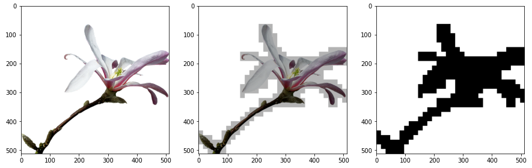

<!-- PROJECT LOGO -->
<br />
<p align="center">
  <a href="https://github.com/badger777/object-search-with-quadtree">
    
  </a>

  <h3 align="center">object-search-with-quadtree</h3>

  <p align="center">
    Search objects quickly used quadtree!
    <br />
    <a href="https://github.com/badger777/object-search-with-quadtree"><strong>Explore the docs »</strong></a>
    <br />
    <br />
    <a href="https://github.com/badger777/object-search-with-quadtree/issues">Report Bug</a>
    ·
    <a href="https://github.com/badger777/object-search-with-quadtree/pulls">Request Feature</a>
  </p>
</p>

<!-- TABLE OF CONTENTS -->
<details open="open">
  <summary>Table of Contents</summary>
  <ol>
    <li>
      <a href="#about-the-project">About The Project</a>
      <ul>
        <li><a href="#built-with">Built With</a></li>
      </ul>
    </li>
    <li>
      <a href="#getting-started">Getting Started</a>
      <ul>
        <li><a href="#prerequisites">Prerequisites</a></li>
        <li><a href="#installation">Installation</a></li>
      </ul>
    </li>
    <li><a href="#usage">Usage</a></li>
    <li><a href="#summary">Summary</a></li>
    <li><a href="#contributing">Contributing</a></li>
    <li><a href="#license">License</a></li>
    <li><a href="#contact">Contact</a></li>
    <li><a href="#acknowledgements">Acknowledgements</a></li>
  </ol>
</details>

<!-- ABOUT THE PROJECT -->
## About The Project


Implement the algorithm of the paper [A Quadtree-based Spatial Object Search Scheme](https://www.ijcse.com/docs/INDJCSE20-11-02-109.pdf).  
In the paper, I implemented the algorithm using Java Swing, but this time I implemented the algorithm using a Jupyter Notebook.

### Built With

* Python 3.7.7
  * Jupyter Notebook 6.0.3
  * Pillow 7.2
  * opencv-python 4.3.0
  * numpy 1.19
  * matplotlib 3.2.2

<!-- GETTING STARTED -->
## Getting Started

### Prerequisites

```bash
$ pip3 install notebook
$ pip3 install Pillow
$ pip3 install opencv-python
$ pip3 install numpy
$ pip3 install matplotlib
```
### Installation

1. Clone the repo
   ```bash
   $ git clone https://github.com/badger777/object-search-with-quadtree.git
   ```

<!-- Usage -->
## Usage

1. Run Jupyter Notebook
   ```bash
   $ jupyter notebook
   ```
2. Run `object_search.ipynb` in Jupyter Notebook

<!-- Summary -->
## Summary

1. The execution time is slower than when implemented in Java.
2. There is a typo in the paper. Check out in [Issues](https://github.com/badger777/object-search-with-quadtree/issues/1)
3. The feature of drawing objects was not implemented in `v1.0.0`.

<!-- CONTRIBUTING -->
## Contributing

1. Fork the Project
2. Create your Feature Branch (git checkout -b feature/AmazingFeature)
3. Commit your Changes (git commit -m 'Add some AmazingFeature')
4. Push to the Branch (git push origin feature/AmazingFeature)
5. Open a Pull Request

<!-- LICENSE -->
## License

Distributed under the MIT License. See `LICENSE` for more information.

<!-- CONTACT -->
## Contact

Hyeongjun Jeon - kr.jeon.dev@gmail.com  
Project Link: [https://github.com/badger777/object-search-with-quadtree](https://github.com/badger777/object-search-with-quadtree)  

<!-- ACKNOWLEDGEMENTS -->
## Acknowledgements

* [Best README Template](https://github.com/othneildrew/Best-README-Template)